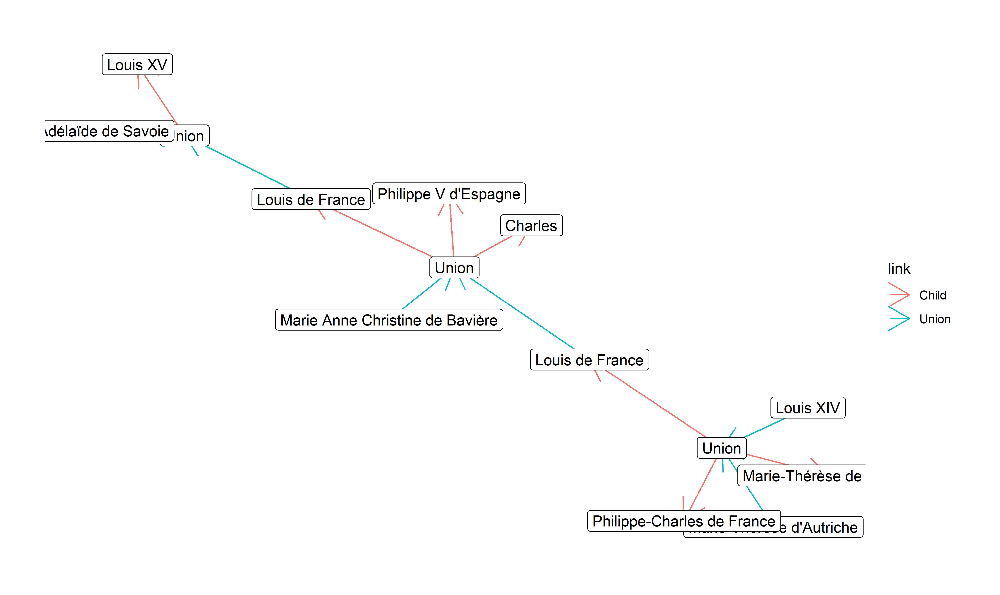

# tidyfamily

A little package to create family dynasties and visualize them as
networks and genealogical trees.

## Current Problems / Features ideas

  - Don’t know how to nicely display them as trees (help by answering
    [**here**](https://stackoverflow.com/questions/67102965/organize-graph-nodes-vertically-according-to-a-y-value-in-r-ggraph))
  - Functions to retrieve family members of a given degree

## Installation

``` r
remotes::install_github("DominiqueMakowski/tidyfamily")

library(tidyfamily)
```

## Create Family Data

``` r
library(tidyfamily)
library(dplyr)

# Louis XIV's unit
data <- family_member("Louis XIV", birth = "1638-09-05", death = "1715-09-01", sex = "Male") %>% 
  family_member("Marie-Thérèse d'Autriche", birth = "1638-10-10", death = "1683-07-30", sex = "Female") %>% 
  family_son("Louis1661", name = "Louis de France", birth = "1661-11-01", death = "1711-04-14", father = "Louis XIV", mother = "Marie-Thérèse d'Autriche") %>% 
  family_daughter("Marie-Thérèse de France", text = "La Petite Madame", birth = 1667, death = 1672, father = "Louis XIV", mother = "Marie-Thérèse d'Autriche") %>% 
  family_son("Philippe-Charles de France", text = "Duc d'Anjou", birth="1668-08-05", death = "1671-07-10", father = "Louis XIV", mother = "Marie-Thérèse d'Autriche") %>% 
  # Louis1661's unit
  family_member("Marie Anne Christine de Bavière", birth = 1660, sex = "Female") %>% 
  family_son("Louis1682", name = "Louis de France", text = "Duc de Bourgogne", birth=1682, death = 1712, father = "Louis1661", mother = "Marie Anne Christine de Bavière") %>% 
  family_son("Philippe V", name = "Philippe V d'Espagne", birth=1683, death = 1746, father = "Louis1661", mother = "Marie Anne Christine de Bavière") %>% 
  family_son("Charles", birth="1686-07-31", father = "Louis1661", mother = "Marie Anne Christine de Bavière") %>% 
  # Louis1682's unit
  family_member("Marie-Adélaïde de Savoie", birth = "1685-12-06", death = "1712-02-12", sex = "Female") %>% 
  family_son("Louis XV", birth = "1710-02-15", death = "1774-05-10", father = "Louis1682", mother = "Marie-Adélaïde de Savoie")

data
```

| id                       | name                     | text             | sex    | birth\_year | birth\_month | birth\_day | birth\_text | death\_year | death\_month | death\_day | death\_text | father    | mother                          | born\_of |
| :----------------------- | :----------------------- | :--------------- | :----- | ----------: | -----------: | ---------: | :---------- | ----------: | -----------: | ---------: | :---------- | :-------- | :------------------------------ | :------- |
| Charles                  | Charles                  | NA               | Male   |        1686 |            7 |         31 | 31 Jul 1686 |          NA |           NA |         NA | Unknown     | Louis1661 | Marie Anne Christine de Bavière | Wedding  |
| Louis XIV                | Louis XIV                | NA               | Male   |        1638 |            9 |          5 | 05 Sep 1638 |        1715 |            9 |          1 | 01 Sep 1715 | NA        | NA                              | Wedding  |
| Louis XV                 | Louis XV                 | NA               | Male   |        1710 |            2 |         15 | 15 Feb 1710 |        1774 |            5 |         10 | 10 May 1774 | Louis1682 | Marie-Adélaïde de Savoie        | Wedding  |
| Louis1661                | Louis de France          | NA               | Male   |        1661 |           11 |          1 | 01 Nov 1661 |        1711 |            4 |         14 | 14 Apr 1711 | Louis XIV | Marie-Thérèse d’Autriche        | Wedding  |
| Louis1682                | Louis de France          | Duc de Bourgogne | Male   |        1682 |           NA |         NA | 1682        |        1712 |           NA |         NA | 1712        | Louis1661 | Marie Anne Christine de Bavière | Wedding  |
| Marie-Adélaïde de Savoie | Marie-Adélaïde de Savoie | NA               | Female |        1685 |           12 |          6 | 06 Dec 1685 |        1712 |            2 |         12 | 12 Feb 1712 | NA        | NA                              | Wedding  |

## Visualize Family Tree

``` r
library(ggraph)
library(tidygraph)

data <- dynasty_capetian()

# edges <- tidyfamily:::.family_get_edges(data)
# nodes <- tidyfamily:::.family_get_nodes(data)
  
  
tidyfamily::family_graph(data) %>%
  ggraph(layout = "nicely") +
  geom_edge_link(aes(color = link), arrow = arrow()) +
  geom_node_label(aes(label = label)) +
  ggraph::theme_graph()
```

<!-- -->
